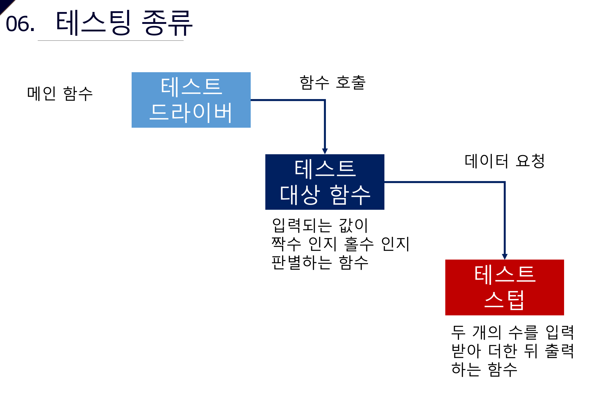

## SW 테스팅 개요

* 소프트웨어 테스팅: 소프트웨어에 있는 결함을 찾아내는 활동
* 소프트웨어 테스팅의 수행
  * 소요되는 비용을 항상 고려해야 함
  * 테스팅을 대충 수행해서도 무작정 많이 수행해서도 안됨

## SW 결함의 원인

* 요구사항 오류
  * 요구사항 정의 미흡
  * 요구사항 관리 실패
  * 개발자와의 소통 미흡
* 설계 오류
  * 요구사항이 제대로 반영되지 않은 설계
* 개발자 오류
  * 개발자의 실수(언어에 대한 이해 미흡, 개발환경에 대한 이해 미흡 등)
* 기타 오류
  * 통신 오류
  * 소프트웨어 구동 환경 오류
  * 다른 시스템과의 상호연동

### SW 결함

#### 결함(Fault)

* 소스코드에 있는 오류
* 개발자의 실수로 잘못 작성된 소스코드

#### 에러(Error)

* 결함으로 인해 내부적으로 잘못 동작되고 있는 상태
* 결함으로 인해 플그램이 잘못 동작하고 있는 상태

#### 실패(Failure)

* 에러로 출력되는 결과

결함이 있다고 무조건 실패로 이어지진 않음. 에러가 있다고 무조건 실패로 이어지진 않음.

### 테스팅 기본 용어

* Testing Data: 시스템을 테스트하기 위한 입력
* Test Case: 시스템을 테스트하기 위해 Spec에 따라 작성된 입력과 예상 출력
* Test Suite: 시스템을 테스트하는데 사용되는 테스트 케이스의 모음
* Test Oracle: 테스트가 통과했는지 실패했는지 판단하기 위해 테스터가 사용하는 매커니즘 / 시스템의 스펙, 관련 문서 등

## V모델

* 요구분석(Requeirement Analysis)=>시스템 설계(System Design)=>상세 설계(Program Structure Design)=>코딩(Code)
* 유닛 테스팅(Unit Testing)=>통합 테스팅(Intergration Testing)=>시스템 테스팅(System Testing)=>인수 테스팅(Acceptance Testing)

## 테스팅 종류

### 시스템 테스트

* 시스템 테스트는 전체 시스템 또는 제품의 동작에 대해 수행하는 테스트
* 가능한 실제 사용 환경과 유사한 환경에서 수행해야 함
* 요구사항에 있는 기능적, 비기능적 사항들이 모두 반영되었는지 확인

### 회귀 테스트

* 소스코드에 변경이 발생했을 때 이전에 수행했던 모든 테스트를 다시 수행하는 테스트 기법
* 소스코드를 변경하면서 새로운 오류가 소스코드에 포함되었는지 확인
* 테스트 케이스가 중복해서 작성되지 않도록 하는 효과도 있음
* 테스트 비용이 많이 요구됨
* 테스트 비용이 많이 요구됨에도 이 테스트를 수행하는 이유는 소스코드의 변경에 대한 분석 비용이 매우 많이 들기 때문

### 스모크 테스트

* 본격적인 테스트의 수행에 앞서, 대상이 테스트를 수행할만한 상태인지 확인
* 쉽게 말하면 테스트 대상이 구동이 되는지 확인하는 테스트로 테스트 케이스 가 필요없음